# MongoDB Task Manager

A task manager site created using a non-relational database, MongoDB. This site was created as part of a walkthrough project from the Code Institute.

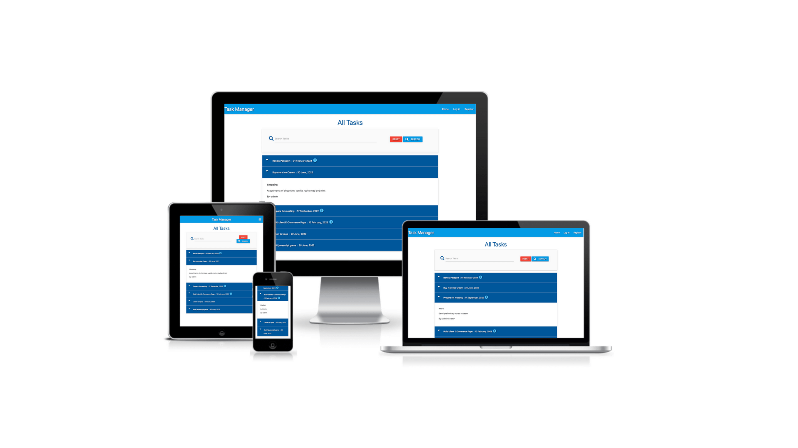

Link to deployed site: [MongoDB Task Manager](https://mongodb-taskmanager.herokuapp.com/)

## CONTENTS

* [User Experience](#User-Experience)
  * [User Stories](#User-Stories)

* [Design](#Design)
  * [Colour Scheme](#Colour-Scheme)
  * [Typography](#Typography)
  * [Imagery](#Imagery)
  * [Wireframes](#Wireframes)
  * [Features](#Features)
  * [Accessibility](#Accessibility)

* [Technologies Used](#Technologies-Used)
  * [Languages Used](#Languages-Used)
  * [Frameworks, Libraries & Programs Used](#Frameworks,-Libraries-&-Programs-Used)
  * [Defensive Programming](#Defensive-Programming)

* [Deployment & Local Development](#Deployment-&-Local-Development)
  * [Deployment](#Deployment)
  * [Local Development](#Local-Development)
    * [How to Fork](#How-to-Fork)
    * [How to Clone](#How-to-Clone)

* [Testing](#Testing)
  
* [Credits](#Credits)
  * [Code Used](#Code-Used)
  * [Content](#Content)
  * [Media](#Media)

- - -

## User Experience

### User Stories

#### First Time Visitor Goals

* As a first time user, I want the site to be easy to navigate.
* As a first time user, I want to be able to add categories to store my tasks in.
* As a first time user, I want to be able to save tasks I create in a category of my choice.
* As a first time user, I want to be able to sign up for an account.

#### Returning Visitor Goals

* As a returning user, I want to be able to edit tasks.
* As a returning user, I want to be able to edit categories.
* As a returning user, I want to be able to log in to my account.

#### Frequent Visitor Goals

* As a frequent user, I want to be able to delete tasks I no longer want.
* As a frequent user, I want to be able to delete categories that I no longer need.

- - -

## Design

### Colour Scheme

The colour theme for the site is the same as the one used during the walkthrough videos, the colours used are from Materialize blue colour palette.

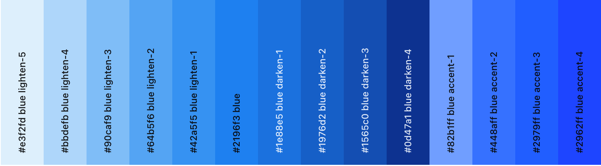

### Typography

No font was specified for use with the site, therefore the default font settings were used.

### Imagery

The site has been created to  learn and showcase CRUD functionality, no images have been used. All icons used in this project were sourced from [Font Awesome](https://fontawesome.com/).

### Wireframes

Wireframes were created for mobile, tablet and desktop using Balsamiq.

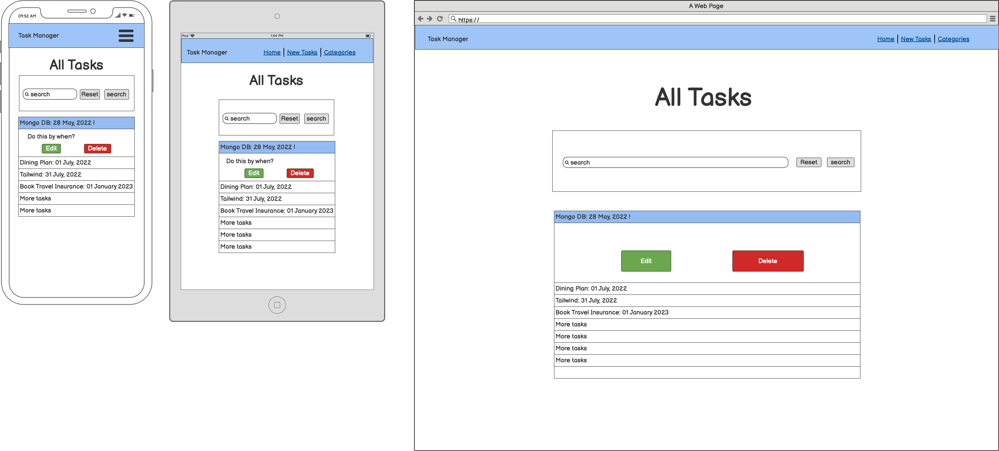

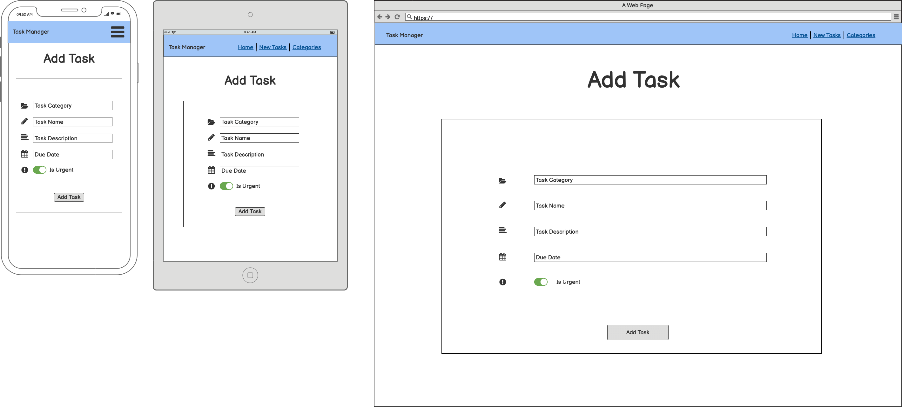

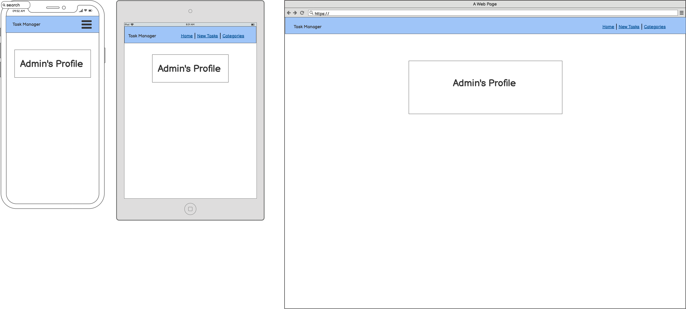

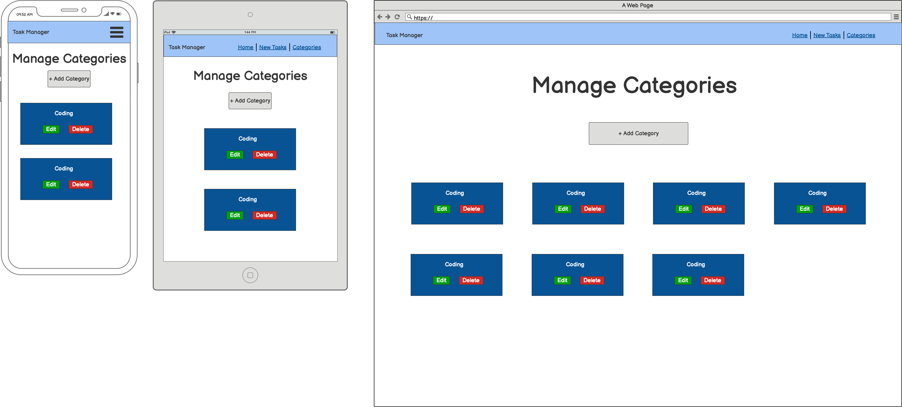

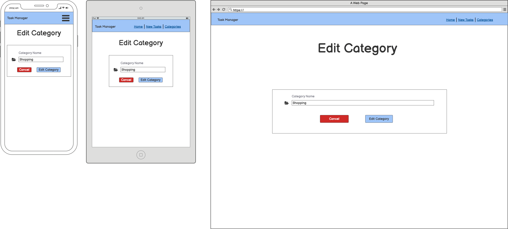

### Features

The website is comprised of 9 pages: The register page which allows users to register an account, the login page, the home page which displays all the users tasks, the profile page, the new task page which allows users to create a new task, the manage categories page which displays all categories, the edit category and edit task pages which allow users to edit an existing category & task and the add tasks and add categories pages which allow users to create new categories and tasks.

All Pages on the website have:

* A Favicon. The favicon for the site was created at [Favicon.io](https://favicon.io/emoji-favicons/check-box-with-check) and was generated using the following graphics from Twitter Twemoji:

  * Graphics Title: 2611.svg
  * Graphics Author: [Copyright 2020 Twitter, Inc and other contributors](https://github.com/twitter/twemoji)
  * Graphics Source: [Twemoji](https://github.com/twitter/twemoji/blob/master/assets/svg/2611.svg)
  * Graphics License: [CC-BY 4.0](https://creativecommons.org/licenses/by/4.0/)

    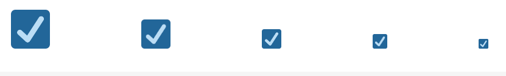

* A Navbar.The navbar contains links to the home, login and register pages when a user is not logged in. When a user is logged in the navbar will then display links for home, profile, new task, manage categories and log out. The navbar is responsive and on smaller devices uses the hamburger icon. When this is clicked the menu opens to the right of the screen.

  

  

  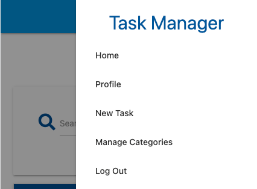

- - -

`Home Page (Tasks)`

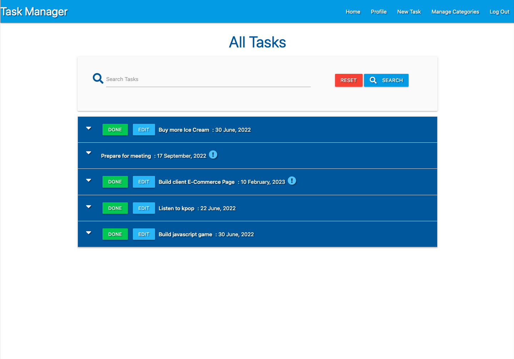

`Register Page`

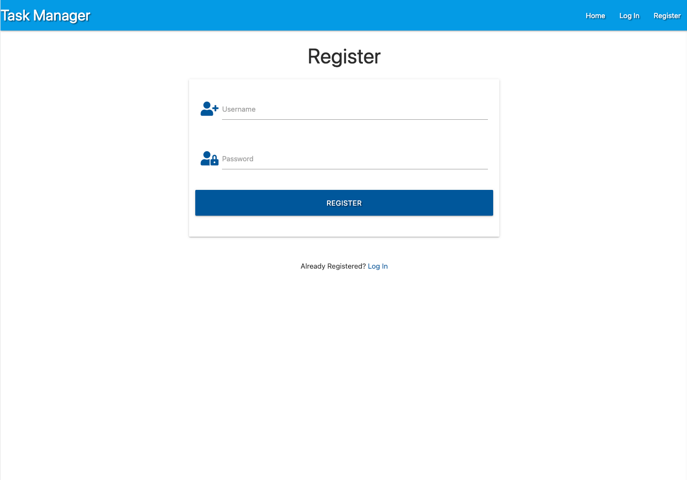

`Login Page`

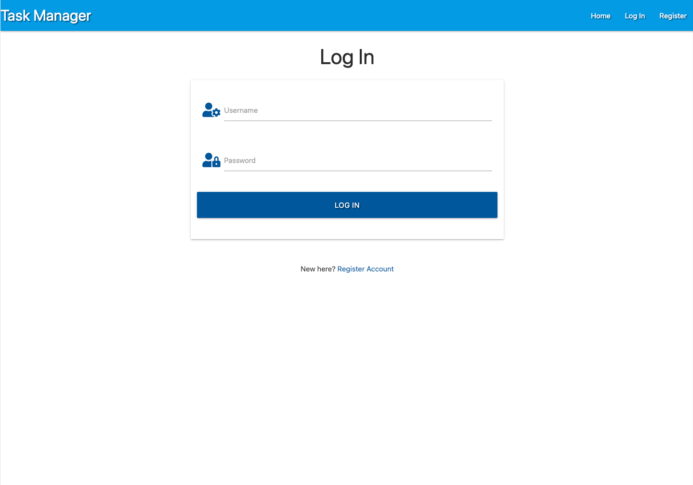

`Profile Page`

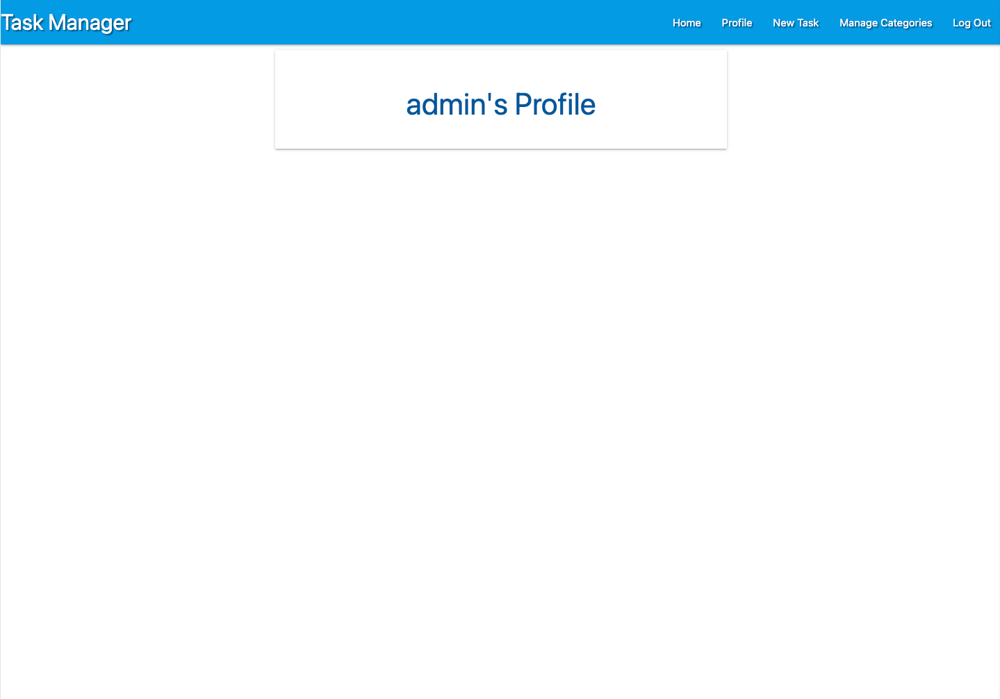

`Add Category Page`

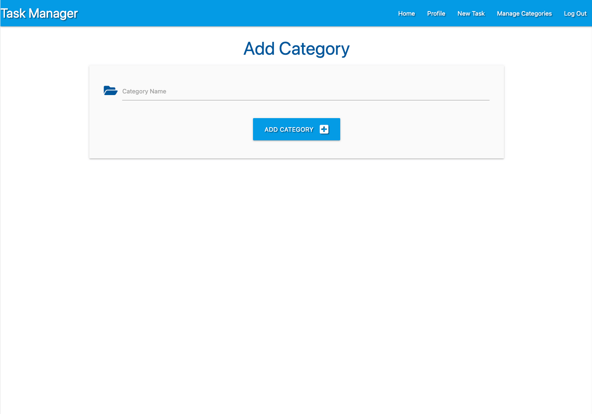

`Add Task Page`

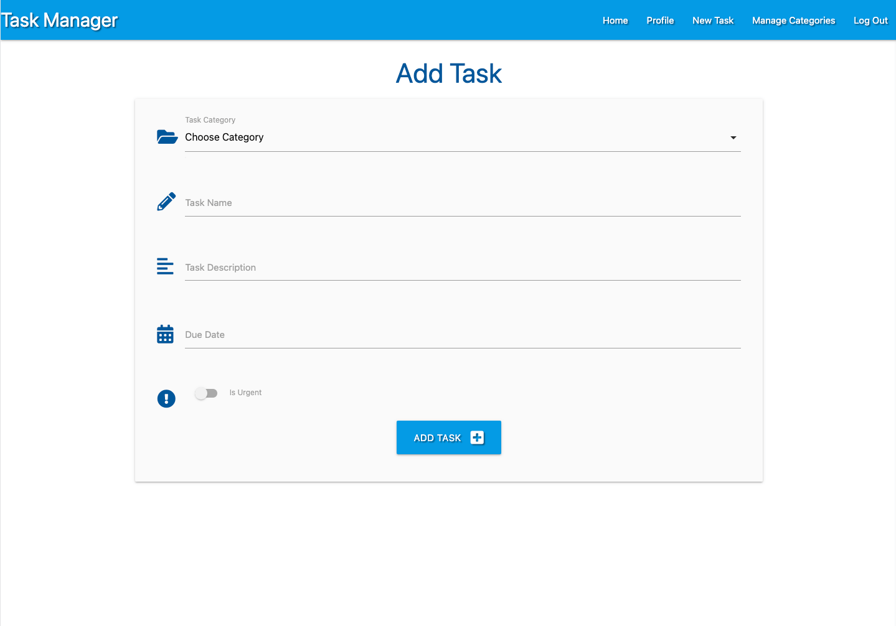

`Categories Page`

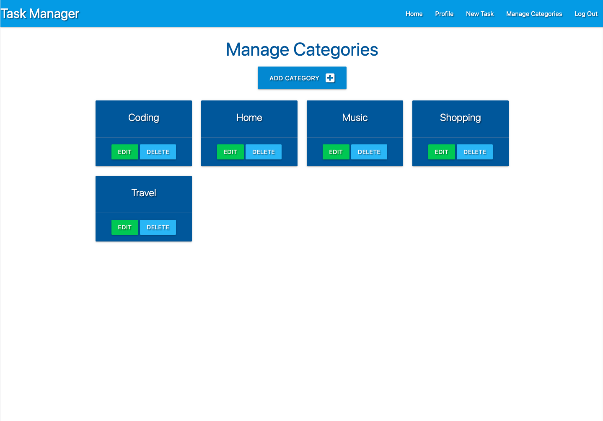

`Edit Category Page`

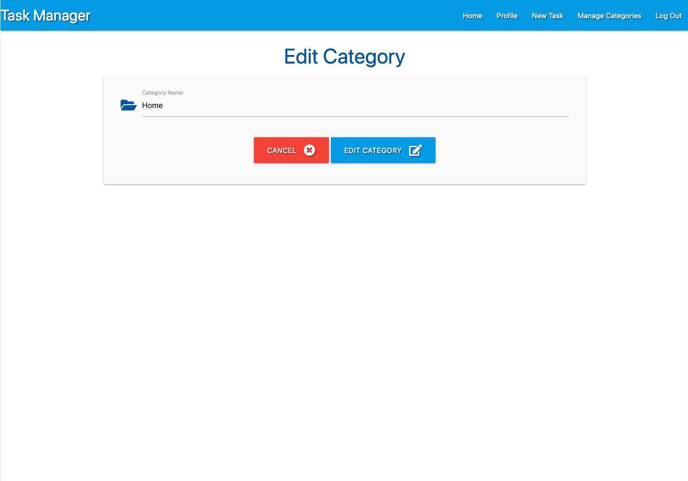

`Edit Task Page`

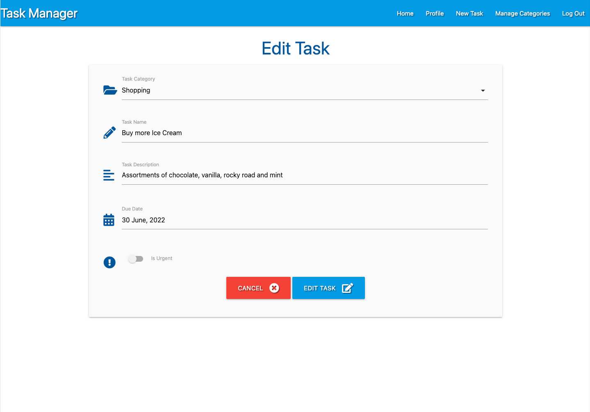

- - -

Future Implementations.

* Defensive programming - I would like to add a modal that pops up when a user wants to delete a category. This would provide an extra layer of security to confirm that the user does want to delete the record from the database, and would alert the user to the fact that this action is permanent and cannot be undone.
* 404 Error Page.
* I would like to improve the profile page for the user, and use this area to allow the user to change their password for their account.

### Accessibility

I have been mindful during coding to ensure that the website is as accessible friendly as possible. This has been have achieved by:

* Using semantic HTML.
* Providing information for screen readers where there are icons used and no text.
* Ensuring that there is a sufficient colour contrast throughout the site.

- - -

## Technologies Used

### Languages Used

HTML, CSS, Javascript, Python

### Frameworks, Libraries & Programs Used

Balsamiq - Used to create wireframes.

Git - For version control.

Github - To save and store the files for the website.

Materialize

Flask

MongoDB

Font Awesome - For the iconography on the website.

Google Dev Tools - To troubleshoot and test features, solve issues with responsiveness and styling.

[Tiny PNG](https://tinypng.com/) To compress images.

[Birme](https://www.birme.net/) To resize images and convert to webp format.

[Favicon.io](https://favicon.io/) To create favicon.

[Am I Responsive?](http://ami.responsivedesign.is/) To show the website image on a range of devices.

[Shields.io](https://shields.io/) To add badges to the README

### Defensive Programming

Info about defensive programming used to go here.

- - -

## Deployment & Local Development

### Deployment

The site is deployed using Heroku

To deploy to Heroku:

1. Go to ..

### Local Development

#### How to Fork

To fork the repository:

1. Log in (or sign up) to Github.
2. Go to the repository for this project, [mongodb-taskmanager](https://github.com/kera-cudmore/mongodb-taskmanager).
3. Click the Fork button in the top right corner.

#### How to Clone

To clone the repository:

1. Log in (or sign up) to GitHub.
2. Go to the repository for this project, [mongodb-taskmanager](https://github.com/kera-cudmore/mongodb-taskmanager).
3. Click on the code button, select whether you would like to clone with HTTPS, SSH or GitHub CLI and copy the link shown.
4. Open the terminal in your code editor and change the current working directory to the location you want to use for the cloned directory.
5. Type 'git clone' into the terminal and then paste the link you copied in step 3 and press enter.

- - -

## Testing

Please see [testing.md](testing.md) for all testing performed

- - -

## Credits

### Code Used

This site was created as part of a walkthrough project with the Code Institute.
