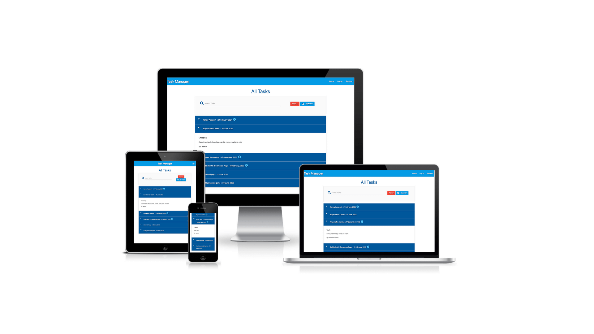

# MongoDB Task Manager

Visit the deployed site: [MongoDB Task Manager](https://mongodb-taskmanager.herokuapp.com/)

- - -

## CONTENTS

* [AUTOMATED TESTING](#AUTOMATED-TESTING)
  * [W3C Validator](#W3C-Validator)
  * [JavaScript Validator](#JavaScript-Validator)
  * [Python Validator](#Python-Validator)
  * [Lighthouse](#Lighthouse)
  * [WAVE Testing](#WAVE-Testing)
* [MANUAL TESTING](#MANUAL-TESTING)
  * [Testing User Stories](#Testing-User-Stories)
  * [Full Testing](#Full-Testing)

Testing was ongoing throughout the entire build. I utilised Chrome developer tools whilst building to pinpoint and troubleshoot any issues as I went along.

During development I made use of google developer tools to ensure everything was working correctly and to assist with troubleshooting when things were not working as expected.

- - -

## AUTOMATED TESTING

### W3C Validator

[W3C](https://validator.w3.org/) was used to validate the HTML on all pages of the website. It was also used to validate the CSS.

* [add_category.html](https://validator.w3.org/nu/?doc=https%3A%2F%2Fmongodb-taskmanager.herokuapp.com%2Fadd_category)
* [add_task.html](https://validator.w3.org/nu/?doc=https%3A%2F%2Fmongodb-taskmanager.herokuapp.com%2Fadd_task)
* [categories.html](https://validator.w3.org/nu/?doc=https%3A%2F%2Fmongodb-taskmanager.herokuapp.com%2Fget_categories)
* [edit_task.html]()
* [login.html](https://validator.w3.org/nu/?doc=https%3A%2F%2Fmongodb-taskmanager.herokuapp.com%2Flogin)
* [profile.html]()
* [register.html](https://validator.w3.org/nu/?doc=https%3A%2F%2Fmongodb-taskmanager.herokuapp.com%2Fregister)
* [tasks.html](https://validator.w3.org/nu/?doc=https%3A%2F%2Fmongodb-taskmanager.herokuapp.com%2Fget_tasks)
* [edit_category.html]()

[style.css](documentation/testing/css.png)

- - -

### JavaScript Validator

[jshint](https://jshint.com/) was used to validate the JavaScript.

* [script.js]](documentation/testing/javascript.png)
- - -

### Python Validator

[PEP8](http://pep8online.com/)was used to validate the python files.

* [app.py](documentation/testing/python.png)

- - -

### Lighthouse

I used Lighthouse within the Chrome Developer Tools to test the performance, accessibility, best practices and SEO of the website.

### Desktop Results

### Mobile Results

- - -

### WAVE Testing

[WAVE](http://wave.webaim.org/) (Web Accessibility Evaluation Tool) allows developers to create content that is more accessible to users with disabilities. It does this by identifying accessibility and WGAC errors.

- - -

## MANUAL TESTING

### Testing User Stories

`First Time Visitors`

| Goals | How are they achieved? |
| :--- | :--- | :--- |
| I want the site to be easy to navigate. | The site features a navbar which allows the user to easily navigate through the site. |  |
| I want to be able to add categories to store my tasks in. | When the user navigates to the manage categories page they are given the option to create a new category. | :--- |
| I want to be able to save tasks I create in a category of my choice. | The user is given the option to create a new task from the home page, and when creating the task they can assign the task to the category of their choice. | :--- |
| I want to be able to sign up for an account. | If a user is not signed in to the site, the register link will display in the navbar, allowing users to sign up to an account. | :--- |

`Returning Visitors`

|  Goals | How are they achieved? |
| :--- | :--- | :--- |
| I want to be able to log in to my account. | If a user is not logged in, the navbar will display a login and register link. | :--- |
| I want to be able to edit tasks. | When the user expands a task, they are given the option via button to edit the task. | :--- |
| I want to be able to edit categories. | When the user visits the categories page, they are given the option via button on each category card to edit the category. | :--- |

`Frequent Visitors`

| Goals | How are they achieved? |
| :--- | :--- | :--- |
| I want to be able to delete categories that I no longer need. | When the user visits the manage categories page, they are given the option via button on each category card to delete the category. | :--- |

- - -

### Full Testing

Full testing was performed on the following devices:

* Laptop:
  * Macbook Pro 2021 14 inch screen
* Mobile Devices:
  * iPhone 13 pro.
  * iPhone 11 pro.
  * Phone X.

Each device tested the site using the following browsers:

* Google Chrome
* Safari
* Firefox

Additional testing was taken by friends and family on a variety of devices and screen sizes.

| Feature | Expected Outcome | Testing Performed | Result | Pass/Fail |
| --- | --- | --- | --- | --- |
| ` Navbar` |
| --- | --- | --- | --- | --- |
| Task Manager site name | Redirects the user to the home page | Clicked the link | Redirected to the home page | Pass |
| Home |  Redirects the user to the home page  | Clicked the link | Redirected to the home page | Pass |
| Profile (Logged in user) | Redirects the user to the profile page | Clicked the link | Redirected to the profile page | Pass |
| New Task (Logged in user) | Redirects the user to the new task page | Clicked the link | Redirected to the new task page | Pass |
| Manage Categories (Logged in user) | Redirects the user to the manage categories page | Clicked the link | Redirected to the manage categories page | Pass |
| Log Out (Logged in user) | Logs the user out of the session and redirects to the home page. Links in the navbar should change to only display home, login and register | Clicked the link | User logged out and redirected to the home page. Links changed in navbar to only display home, login and register  | Pass |
| Login (No user in session) | Redirects the user to the login page | Clicked the link | Redirected to the login page | Pass |
| Register (No user in session) | Redirects the user to the register page | Clicked the link | Redirected to the register page | Pass |
| Hamburger menu on smaller devices | Opens the full nav menu | Clicked on the hamburger menu | full menu opens | Pass |

|  |  |  |  |  |
|  |  |  |  |  |
|  |  |  |  |  |
